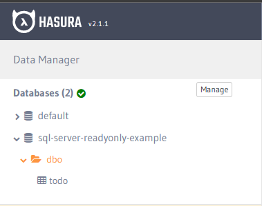
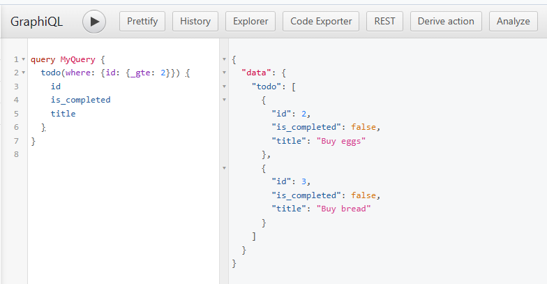
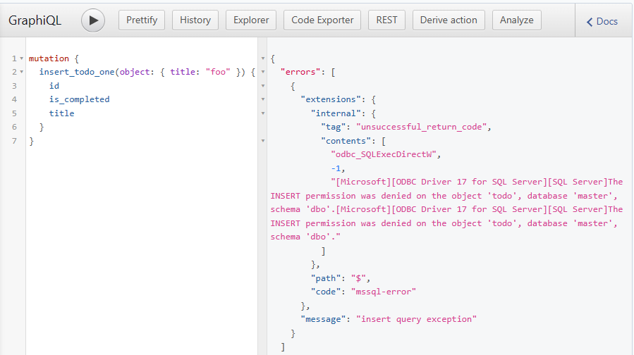

# Hasura Read-Only MS SQL Server Example

- [Hasura Read-Only MS SQL Server Example](#hasura-read-only-ms-sql-server-example)
  - [Description](#description)
  - [Instructions](#instructions)
  - [How it works](#how-it-works)

## Description

This repo contains an example configuration for using Hasura with a read-only MS-SQL user.

## Instructions

1. Clone this repo
2. Run `docker compose up -d` to start Hasura, Postgres, and MS-SQL
3. `cd hasura` and then run `hasura migrate apply` to configure the MS-SQL database connection
4. You should now see a DB called `sql-server-readonly-example` with a single table called `todo` that contains some test records
5. Try to query and insert data. You should be able to read from `todo`, but not insert them or modify the DB schema

- 

- 

- 

## How it works

There is a series of commands in the `docker-compose.yaml` service for MS-SQL that copy all files from the `mssql-scripts` folder into the container, and then execute them.

The file `mssql-scripts/create-readonly-user.sql` contains the SQL-Server statements to create the `[dbo].todo` table, and the example readonly user.